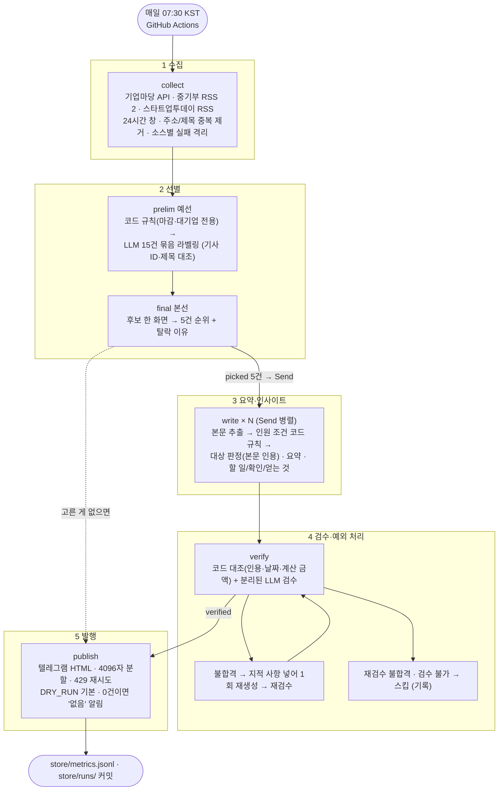
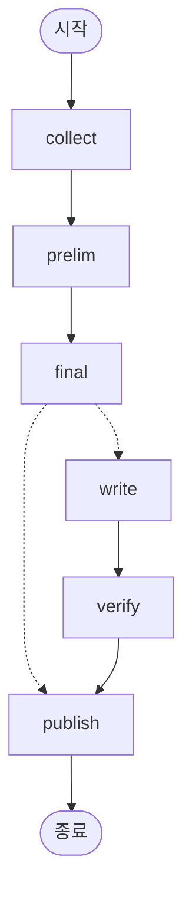
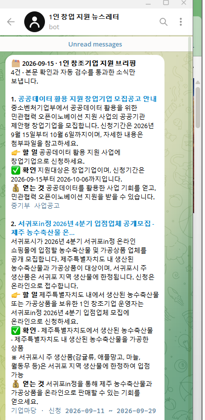
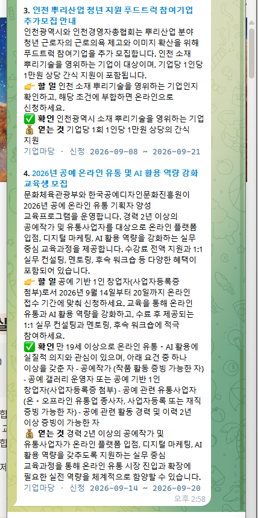

# REPORT — 1인 창업 지원 뉴스 브리핑 에이전트 - 조경호

「나만의 뉴스레터 에이전트 구축하기」 제출 보고서.

- **저장소**: https://github.com/nike1137-svg/gov-support-newsletter
- **독자**: 혼자 사업을 준비하거나 막 시작한 1인 창조기업 운영자
- **발행 채널**: 텔레그램 봇 (HTML 메시지 · 4096자 넘으면 나눠 보냄)
- **주기**: 매일 07:30 KST 발송
  - GitHub Actions 예약 실행 · 수동 실행 버튼(발행 없이 로그만 남기기 선택 가능)
  - 실행이 끝나면 `store/metrics.jsonl` · `store/runs/` 를 저장소에 커밋
- **모델**: `gpt-4.1-mini`, temperature 0, 모든 LLM 호출 구조화 출력(pydantic) · 1회 실행 약 $0.03
- **과제 제외 소스 6곳**(OpenAI · DeepMind · TechCrunch · The Verge · MIT TR · AI타임스): 주제가 달라 후보에 넣지 않았고, 수집·측정 전에 코드가 주소를 검사해 걸리면 멈춘다
- 모든 수치는 2026-09-15 실측이며 근거 파일 경로를 함께 적었다

| 필수 단계 | 구현 위치 | 이 보고서 |
|---|---|---|
| 1. 자료 수집 (3곳 이상, 채택·탈락 근거) | `graph.collect` · `tools/probe_sources.py` · `docs/source-criteria.md` | 2장 |
| 2. 자료 선별 (3~5건, 기준과 근거 로그) | `graph.prelim` · `graph.final` · `audience.yaml` | 3장 |
| 3. 요약 및 인사이트 | `graph.write` · `graph.extract_body` · `graph.draft_ok` | 4장 · 6장 |
| 4. 자동 검수 및 예외 처리 | `graph.verify` · `graph.code_check` · `tools/prove_verify.py` | 5장 |
| 5. 최종 발행 | `graph.publish` · `.github/workflows/daily.yml` | 5장 |

---

## 1. 분야 및 독자 정의

### 분야를 고른 배경

| 고려한 것 | 판단 |
|---|---|
| 겹치지 않을 것 | AI 동향은 이미 다른 에이전트로 매일 받고 있다. 과제의 제외 소스 6곳도 AI 뉴스다 |
| 매일 받을 이유가 있을 것 | 지원사업은 **신청 마감**이 있다. 하루 늦게 알면 놓친다 — 일간 발행의 필요가 분명하다 |
| 기준이 동작했다는 근거를 남기기 쉬울 것 | 공고에는 지원대상 · 신청기간 · 지원금액 같은 필드가 있어 선별·검수를 **수치와 라벨**로 검증할 수 있다 |
| 내게 쓸모 있을 것 | 1인 사업을 구상 중이라 직접 받아 볼 정보다 |

처음엔 "정부 지원사업 공고"로 좁게 잡았다가, 소스 측정(2절) 결과 채택이 1곳뿐이어서 **독자 기준으로 범위를 넓혔다** — 공고만이 아니라 독자에게 필요한 정책 변화 · 창업 소식까지.

### 타깃 독자 페르소나

> **혼자 사업을 준비하거나 막 시작한 1인 창조기업 운영자**

| 항목 | 내용 (`audience.yaml`) |
|---|---|
| 원하는 것 | 지금 신청할 수 있는 지원사업 공고 · 창업자에게 영향을 주는 정책 변화 · 초기 창업 기업의 소식과 투자 흐름 |
| 필요 없는 것 | 신청 마감이 지난 공고 · 대기업·중견기업 전용 · 행사 사진·인사 동정·수상 소식 · 직원 N명 이상이 필수인 사업 |
| 판정 주의 | 1인 창조기업은 규모상 중소기업 · 소상공인에 들어간다. 지원대상이 그렇게 적힌 공고는 독자도 대상으로 본다 |

독자 · 중요도 기준 · 제외 조건은 전부 `audience.yaml` 한 파일에 있고, 워크플로(`graph.py`)와 소스 측정 도구(`tools/probe_sources.py`)가 같은 파일을 읽는다.

---

## 2. 소스 채택표

### 채택 기준 (`docs/source-criteria.md`)

측정 **전에** 기준을 확정하고, 모든 후보를 같은 스크립트(`tools/probe_sources.py`) · 같은 시각에 쟀다.

| | 기준 | 재는 방법 | 탈락 조건 |
|---|---|---|---|
| C1 | 접근 | HTTP 코드 · 항목 수 · 제목이 한글로 읽히는가 | 200 아님 · 0건 · 글자 깨짐 |
| C2 | 날짜 | 발행일이 있는 항목 비율 | 날짜 없음 (매일 창으로 자를 수 없음) |
| C3 | 매일 공급 | 72시간 창 건수 | v2: 72시간에 0건 · 채택 소스 합계 하루 5건 미만 |
| C4 | 독자 적합 | 최신 10건 제목 중 독자 키워드 비율 | 50% 미만 |
| C5 | 이용 조건 | 키 필요 · 무료 여부 · 한도 | 유료 · 자동 과금 |

독자 키워드(C4): 창업 · 스타트업 · 소상공인 · 중소기업 · 1인 · 지원 · 정책 · 공고 · 모집 · 세금 · 투자

### 기준 v1 → v2 로 바꾼 이유

| | v1 | v2 | 바꾼 이유 |
|---|---|---|---|
| C3 | 소스마다 하루 1건 이상 | 소스는 72시간에 1건 이상, 채택 소스 **합계** 하루 5건 이상 | 과제 요구는 파이프라인 전체 3~5건이지 소스별 공급량이 아니다 |
| C4 | 제목에 공고·모집·지원·사업 | 독자 키워드 비율 | 독자를 정했으니 "공고냐"가 아니라 "이 독자에게 쓸모 있냐"로 본다 |

v1 결과는 지우지 않고 `store/source_probe_v1.json` 에 보관했다.

### v1 측정 — 4곳 (12:18 KST · `store/source_probe_v1.json`)

| 소스 | 형태 | 72h / 하루 | C4 | 판정 | 걸린 기준 |
|---|---|---|---|---|---|
| 기업마당 지원사업정보 | API (키) | 34 / 11.3 | 10/10 | 채택 | — |
| K-Startup 사업공고 | API (키) | 0 / 0 | 8/10 | 탈락 | C3 — 모집중 231건 전부 받았으나 72h 접수 시작 0건 |
| 중소벤처기업부 사업공고 | RSS | 2 / 0.7 | 10/10 | 탈락 | C3 |
| 중소벤처기업부 보도자료 | RSS | 5 / 1.7 | 1/10 | 탈락 | C4 |

채택 1곳 → 과제 요구(3곳 이상) 미달 → 독자 범위를 넓히고 RSS 후보 19곳을 탐색했다.

### v2 측정 — 13곳 (12:27 KST · `store/source_probe.json`)

| 소스 | 72h / 하루 | C4 | 판정 | 걸린 기준 |
|---|---|---|---|---|
| **기업마당** | 34 / 11.3 | 10/10 | **채택** | — |
| **중기부 사업공고** | 2 / 0.7 | 10/10 | **채택** | — |
| **중기부 보도자료** | 5 / 1.7 | 7/10 | **채택** | — |
| **스타트업투데이** | 4 / 1.3 | 6/10 | **채택** | — |
| K-Startup | 0 / 0 | 10/10 | 탈락 | C3 |
| 중소기업뉴스 | 30 / 10.0 | 2/10 | 탈락 | C4 |
| 중기이코노미 | 16 / 5.3 | 1/10 | 탈락 | C4 — 거시경제·증시 기사 위주 |
| 벤처스퀘어 | 30+ / 10.0+ | 1/10 | 탈락 | C4 |
| 스타트업엔 | 29+ / 9.7+ | 2/10 | 탈락 | C4 |
| 비석세스 | 15 / 5.0 | 0/10 | 탈락 | C1 — UTF-8 로 다시 풀어도 제목이 깨짐 |
| 아웃스탠딩 | 8 / 2.7 | 3/10 | 탈락 | C4 |
| 한국경제 | 50+ / 16.7+ | 1/10 | 탈락 | C4 |
| 전자신문 | 30+ / 10.0+ | 3/10 | 탈락 | C4 |

`+` 는 피드가 72시간을 다 덮지 못해 실제보다 적게 센 하한값.
**채택 4곳 · 하루 합계 15.0건 → 3곳 이상 · 하루 5건 이상 통과.** 제외 목록 6곳은 스크립트가 주소를 검사해 후보에 없음을 확인했다.

탐색 단계에서 열리지 않아 후보에서 뺀 곳: 플래텀 · 매일경제(403), 소상공인신문 · 정책브리핑 · 국세청(404), 이노플랫폼(SSL 오류), 창업진흥원(빈 피드), 요즘IT(날짜 없음)

| 소스 | C5 이용 조건 |
|---|---|
| 기업마당 | 인증키 필요 · 요금 문구 없음 · 결제 절차 없음 |
| K-Startup | 공공데이터포털 서비스키 · 무료 · 개발계정 하루 10,000회 |
| RSS 9곳 | 키 불필요 · 공개 피드 |

### 측정 중 잡은 측정 오류 (결과 파일을 지우고 다시 쟀다)

- **K-Startup 은 최신순 정렬이 아니다.** 첫 페이지 200건만 받고 "창을 다 덮었다"고 판단한 것이 틀렸다
- **K-Startup 날짜 필터 `cond[pbanc_rcpt_bgng_dt::GTE]` 는 넣어도 결과가 같다.** `totalCount` 는 필터와 무관한 데이터셋 전체(30,080), 필터 후 건수는 `matchCount` 다 → 모집중 필터(동작 확인)로 231건을 전부 받아 직접 셌다

### 한계

- 중소기업뉴스는 `中企` 표기를 써서 키워드에 안 걸렸다. 넣으면 5/10 으로 경계선 통과지만, **측정 후 기준을 고치면 결과에 기준을 맞추는 것**이라 반영하지 않았다
- 측정은 화요일 낮 한 번이고 72시간 창에 주말이 들어갔다. 평일 창 반복 측정은 하지 못했다

---

## 3. 선별 로직 설계

### 중요도 판단 문장 (`audience.yaml`)

```
중요도 기준 (위가 우선)
- 기준1: 지금 신청할 수 있고 1인·예비창업자도 대상인 지원사업
- 기준2: 1인 창조기업 운영에 직접 영향을 주는 정책 변화 (세금 · 자금 · 규제)
- 기준3: 초기 창업 기업의 실행 사례와 투자 흐름

버릴 것
- 버림1: 신청 마감이 지난 공고                                   (코드)
- 버림2: 대기업·중견기업만 대상이고 중소기업·소상공인·창업자가 빠진 공고  (코드 + LLM)
- 버림3: 행사 사진·인사 동정·수상 소식처럼 독자가 행동할 거리가 없는 것   (LLM)
- 버림4: 위 세 기준 어디에도 해당하지 않는 것                        (LLM)
```

### 예선 / 본선 2단계 구조

```
수집 N건
 └ [예선-규칙]  코드가 필드로 판정 — 신청기간 끝 < 오늘(버림1), 지원대상이 중견·대기업뿐(버림2)
 └ [예선-LLM]  15건씩 묶어 모든 기사에 라벨 1개 + 근거 한 문장 (기준1~3 / 버림2~4)
 └ [본선]      기준 라벨이 붙은 후보를 한 화면에 놓고 5건을 순위대로. 고르지 않은 후보에도 탈락 이유
```

- **규칙을 LLM 앞에 둔 이유** — 근거가 필드에 그대로 있는 판정(날짜 비교)은 LLM 에 맡길 이유가 없다. 틀릴 수 없고 비용도 없다
- **예선에서 모든 기사에 라벨을 받는 이유** — "왜 떨어졌는지"가 남아야 기준이 동작했는지 확인할 수 있다. 통과분만 받으면 탈락 근거가 없다
- **본선에서 5건을 고르는 이유** — 과제는 3~5건이다. 처음엔 3~5건을 LLM 에게 맡겼는데 3건을 고른 날 검수에서 1건이 빠져 **발행 2건(최소 미달)** 이 됐다(14:05). 검수 탈락 몫을 남긴다

### 묶음(Batch) 크기 15 로 정한 이유

- **하루 공급량** — 채택 소스 24시간 창 실측이 9~28건이다. 15건이면 대부분 1~2묶음에 끝나 LLM 호출이 적다
- **출력 크기** — 기사마다 라벨과 근거 문장을 받으므로 출력이 묶음 크기에 비례해 커진다. 40건 묶음은 한 응답에 40개 판정을 받는 셈이다
- **실제로 본 누락** — 11건 묶음에서도 마지막 번호의 라벨이 세 번 연속 빠졌다. 크기를 줄이는 것만으로는 부족해 **순번 대신 기사 ID + 제목을 되받아 코드가 대조**하도록 바꾼 뒤 누락이 없어졌다
- **하지 못한 것** — 10·20·40 크기별 통과 명단 비교 실험은 하지 않았다. 15 는 위 근거로 정한 값이지 실험으로 최적화한 값이 아니다

### 기준이 올바르게 동작했다는 근거

기사마다 붙은 라벨과 이유는 `store/runs/<실행>.json` 의 `screened` 에, 라벨별 건수는 `store/metrics.jsonl` 에 남는다.
아래는 GitHub Actions 실행(14:57, 최종 발행분)의 실제 기록이다.

| 단계 | 기사 | 라벨 | 이유 (LLM 출력 그대로, 일부) |
|---|---|---|---|
| 예선 | 벤처기업협회, 우즈베키스탄과 창업 파트너십 구축 | 버림4 | 해외 파트너십 구축 소식으로 1인 창조기업 지원사업이나 정책 변화에 직접 영향 없음 |
| 예선 | 에버트레져, BNK투자증권과 맞손 | 버림4 | 핀테크 스타트업과 증권사 협약 소식 |
| 예선 | 원프레딕트, 기술특례상장 기틀 마련 | 기준3 | 초기 창업 기업의 상장 준비·투자 흐름 |
| 예선 | 서귀포in정 입점업체 모집 | 기준1 | 소상공인 대상 입점 모집 공고로 1인 창조기업도 신청 가능 |
| 본선 | 공공데이터 활용 지원 창업기업 모집 | 선택 1위 | 지금 신청할 수 있는 창업기업 대상 공고 |
| 본선 | 원프레딕트 | **탈락** | 투자 흐름 사례이긴 하나 독자가 지금 신청하거나 행동할 수 있는 정보가 아님 |

```
수집 9 → 예선 라벨 {기준1: 5, 기준3: 1, 버림4: 3} → 통과 6 → 본선 5 선택 · 1 탈락
```

### 선별 안전장치 — 구현 중 실제로 드러난 결함에서 나왔다 (`docs/dev-log.md`)

| 드러난 것 | 고친 것 | 검증 |
|---|---|---|
| LLM 이 '지원대상: 중소기업' 9건을 "대기업 전용"(버림2)으로 버림 | 기준 문구를 좁히고, 지원대상에 중소·소상공인·창업이 있는데 버림2 면 되돌려 보냄 | `tools/verify_select.py` |
| **본선에서 번호가 한 칸 밀려 다른 기사의 선택 이유가 붙음** | 순번 대신 기사 ID 와 제목을 되받아 코드가 대조 | 〃 |
| 예선·본선 LLM 이 끝내 실패하면 멈춤 | 예선은 규칙 통과분을 넘기고, 본선은 기준 순위·최신순 대체 규칙으로 5건 | 〃 (4/4) |

---

## 4. 파이프라인 구조도



### State 흐름 (`graph.py` 의 `Brief`)

| 키 | 채우는 노드 | 리듀서 | 내용 |
|---|---|---|---|
| `hours` | 입력 | — | 수집 시간 창 (24) |
| `collected` | collect | 없음 | 중복 제거한 기사 · 기업마당은 지원대상·신청기간·분야 라벨 포함 |
| `screened` | prelim · final | `operator.add` | 기사마다 단계 · 라벨 · 이유 — 선별 근거 |
| `survivors` | prelim | 없음 | 기준 라벨이 붙은 예선 통과분 |
| `picked` | final | 없음 | 본선 선택 5건 (순위 · 선택 이유) |
| `drafted` | write × N | `operator.add` | 병렬 워커가 나눠 채우는 요약·인사이트 |
| `reviewed` | verify | 없음 | 검수 기록(시도별 코드 대조 · 근거 없는 주장)이 붙은 전체 |
| `verified` | verify | 없음 | 발행할 것 — 줄이는 키라 리듀서를 두지 않았다 |
| `messages` | publish | 없음 | 실제로 보낸 텔레그램 메시지 |
| `stats` | 모든 노드 | dict 병합 | 단계별 수치 · 토큰 → `store/metrics.jsonl` |
| `log` | 모든 노드 | `operator.add` | 사람이 읽는 실행 기록 |

LangGraph 가 코드에서 뽑은 뼈대 (`graph.build().get_graph().draw_mermaid()` 출력에서 스타일 줄만 뺐다). 점선은 실행 시점에 갈리는 조건부 엣지다:



---

## 5. 실행 기록

### 최종 발행 — GitHub Actions 예약 워크플로 수동 실행

[run 34934828691](https://github.com/nike1137-svg/gov-support-newsletter/actions/runs/34934828691) · 2026-09-15 14:57 KST · 1분 45초 · 전 단계 성공 · 봇 커밋 `run: 2026-09-15_1458 KST`

```
⊙ 수집  24시간 창 · 9건 (기업마당 4 · 중기부 사업공고 1 · 중기부 보도자료 0 · 스타트업투데이 4)
⊙ 예선  9 → 규칙 제외 0 → LLM 묶음 1개(15건씩) → 통과 6 · 라벨 {기준1: 5, 버림4: 3, 기준3: 1}
⊙ 본선  6 → 5건 {기준1: 5}
   요약 스킵 a008 · 대상 아님
⊙ 검수  4 → 발행 가능 4건 · {통과: 3, 재생성 후 통과: 1}
⊙ 발행  4건 · 메시지 1개(2,522자) · 텔레그램 1/1개 전달
```

LLM 호출 17회(재시도 4) · 약 $0.03 · 원자료 `store/runs/2026-09-15_1457.json`

### 텔레그램 수신 화면

| 머리말 · 1~2번 | 3~4번 |
|---|---|
|  |  |

캡처 시점의 머리말은 이름을 정하기 전이라 "1인 창조기업 지원 브리핑"이다. 이후 "1인 창업 지원 뉴스 브리핑"으로 바꿨다.

### 검수가 틀린 요약을 걸러낸다는 증명 — `tools/prove_verify.py` (실제 LLM)

평소 발행에서 검수 불합격이 0건이면 "요약이 정확해서"인지 "검수가 도장만 찍어서"인지 가를 수 없다. 틀린 입력을 일부러 넣었다.

| 입력 | 기대 | 결과 |
|---|---|---|
| A 정상 요약 | 통과 | ✅ 통과 |
| B 금액 변조 (월 30만 → 50만 원) | 불합격 | ✅ 불합격 |
| C 마감일 변조 (9/18 → 9/28) | 불합격 | ✅ 불합격 (코드 날짜 대조 + LLM) |
| D 본문에 없는 조건 추가 (업력 3년 이내) | 불합격 | ✅ 불합격 |
| E 나이 조건 변조 (18~39 → 20~45세) | 불합격 | ✅ 불합격 |
| F 계산된 금액 (30만 × 6개월 = 180만 원) | 통과 (오탐 없어야) | ✅ 통과 |
| G B 를 검수 노드에 넣음 | 재생성 후 변조값 제거 | ✅ 재생성 후 통과 · '50만' 남지 않음 |
| H 검수 LLM 호출 실패 | 발행 안 함 | ✅ 스킵 · 검수 불가 |

**8/8** · 호출 10회 · 약 $0.017 · `store/verify_proof.json`. 첫 시도는 **3/8** 이었다 (6절).

### 오프라인 검증 (LLM 없음 · 비용 0)

| 스크립트 | 확인하는 것 | 결과 |
|---|---|---|
| `tools/verify_collect.py` | 라벨 필드 · 소스 실패 격리 · 제외 소스 차단 · 중복 제거 | 4/4 |
| `tools/verify_select.py` | 규칙 버림 · ID/제목 대조 · 버림2 가드 · LLM 실패 대체 | 4/4 |
| `tools/verify_write.py` | 기업마당 본문 추출 · 실제로 나왔던 불량 출력을 포함한 13케이스 · 본문 없음 스킵 · 인원 조건 규칙 | 4/4 |
| `tools/verify_verify.py` | 인용 대조 · 근거 구절 · 계산 금액 · 날짜 불합격 | 4/4 |

---

## 6. 프로젝트 회고

### 가장 공들인 부분 — 그럴듯하게 틀린 출력을 잡는 일

LLM 출력은 형식이 맞고 문장이 자연스러워서, 틀려도 겉보기로는 알 수 없었다. 오늘 실제로 나온 것들:

| 단계 | 그럴듯하게 틀린 출력 | 가만히 뒀다면 |
|---|---|---|
| 선별 | 본선 3·4위의 선택 이유가 **이웃 기사의 내용** (번호 한 칸 밀림) | 엉뚱한 공고가 틀린 이유를 달고 발행 |
| 요약 | '상시근로자 5인 이상' 공고에 **"1인 창조기업은 참여를 고려하세요"** | 신청할 수 없는 사업을 권함 — 실제로 한 번 발행됐다 |
| 요약 | "규모가 큰 사업임을 **유추할 수 있어** 대상 아님" | 좋은 공고를 추측으로 버림 |
| 검수 | "계산한 값임"이라고 **스스로 적고도** 근거 없음 판정 | 맞는 요약이 불합격 |

해결은 매번 같은 방향이었다 — **LLM 은 판단하고, 코드는 대조한다.**
순번 대신 ID 와 제목을 되받아 대조, 판정 근거는 본문 인용으로 받아 실제로 있는지 대조, 인원 조건과 계산 금액은 코드가 직접 판정.
지시문을 고치는 것만으로는 같은 실수가 되풀이됐고, 코드 대조를 붙인 뒤에 멈췄다. 모든 사례는 회귀 테스트(`tools/verify_*.py`)로 남겼다.

### 두 번째로 공들인 부분 — 도구 자체를 의심하기

- 검수 증명 첫 결과는 **3/8** 이었다. 원인은 LLM 이 아니라 내가 만든 인용 대조가 너무 엄격해서 정상 요약까지 '검수 불가'로 만든 것이었다
- K-Startup 측정은 두 번 무효였다. 정렬되지 않은 목록의 첫 페이지만 보고 "다 덮었다"고 판단했고, 동작하지 않는 필터와 전체 건수(`totalCount`)를 믿었다
- Actions 첫 실행은 `requirements.txt` 에 `trafilatura` 가 빠져 실패했다. 로컬 가상환경에는 설치돼 있어 드러나지 않았다 → 빈 가상환경에서 설치·import 를 확인한 뒤 재실행했다

재는 도구가 틀리면 그 위의 판정이 전부 틀린다. 결과가 이상할 때 대상보다 도구를 먼저 봤다.
실패한 실행의 기록 파일은 지우고 다시 쟀고, 무엇이 틀렸는지는 `docs/dev-log.md` 에 남겼다.

### 향후 보완하고 싶은 점

| 한계 (실제 발행물에서 확인) | 보완 방향 |
|---|---|
| 검수는 "본문에 근거하는가"만 본다. 14:57 발행의 **뿌리산업 푸드트럭**(근로자 간식 지원)은 사실은 맞지만 1인 창조기업에게 쓸모가 거의 없다 | 발행 직전에 "독자가 이 정보로 할 수 있는 행동이 있는가"를 판정하는 단계, 또는 사람 승인 단계 |
| 본선이 매일 기준1(공고)만 5건 고른다. 기준2(정책)·기준3(창업 소식)은 거의 안 나온다 | 기준별 최소 몫(예: 공고 3 + 소식 1~2) 을 두는 선별 |
| `불명` 판정의 정확도 — 본문에 '충남 소재 중소 제조기업'이 있는데 불명으로 둔 사례 | 지원대상 필드를 본문에서 코드로 먼저 뽑아 LLM 에게 넘기기 |
| 지역 한정 공고(부산 서구 · 제주 서귀포)가 섞인다. 독자의 거주지를 모른다 | `audience.yaml` 에 지역을 넣고 예선 규칙으로 |
| 묶음 크기 15 · 본선 5건은 근거로 정한 값이지 실험으로 최적화하지 않았다 | 10·20·40 크기별 통과 명단 비교, 며칠치 `metrics.jsonl` 로 단계별 통과율 추이 |
| 소스 측정이 한 번뿐 (주말이 낀 72시간 창) · 중소기업뉴스의 `中企` 표기 누락 | 평일 창으로 1주일 반복 측정 후 기준 v3 |
| 기업마당 본문은 페이지 구조(`s_title`/`txt`)에 기대는 전용 추출기다 | 구조가 바뀌면 본문 길이 급감을 감지해 알림 |
| 추측 표현 검사는 단어 목록이다. 14:57 발행에서 "가능성이 **높아**"로 대상아님 판정이 빠져나갔다 (목록에 '가능성이 있'만 있었음 — 발견 후 넓힘) | 표현 목록 대신 "판정 근거 인용 안에 탈락 조건 자체가 들어 있는가"를 코드로 대조 |
